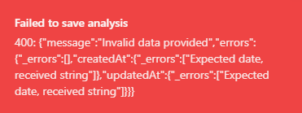

# Life Activity Visualizer

A comprehensive web application that provides intelligent, real-time insights into personal time allocation, enabling users to dynamically explore and optimize their lifetime productivity through advanced health and performance tracking.


## Key Features

### 🎯 **Intelligent Life Analysis**
- **Personalized Time Tracking**: Input your birthdate, country, and daily activities for comprehensive life analysis
- **Real-World Data Integration**: Automatically fetches accurate life expectancy data from World Bank API
- **Smart Activity Recognition**: Intelligent icon assignment and categorization for activities
- **Precision Analytics**: Years remaining displayed to 1 decimal place for accurate planning

### 📊 **Advanced Visualizations** 
- **Interactive Life Grid**: View your entire life in weeks with visual progress tracking
- **Dynamic Chart Updates**: Real-time pie and bar chart updates as you explore different timeline scenarios
- **Timeline Projections**: Adjust future age slider to see instant recalculations across all metrics
- **Activity Comparisons**: Each activity shows 2 meaningful real-world comparisons for context

### 🏥 **Health Optimization System**
- **Sleep Analysis**: Comprehensive sleep quality assessment with WHO guideline comparisons
- **Exercise Optimization**: Fitness level categorization with personalized workout recommendations  
- **Health Impact Scoring**: Color-coded indicators (green/yellow/red) for immediate health feedback
- **Lifespan Enhancement**: Calculate potential longevity gains from lifestyle improvements
- **Medical Disclaimers**: Comprehensive health disclaimers and professional consultation guidance

### 🎨 **Enhanced User Experience**
- **Visual Button Enhancements**: Gradient-styled "Add Custom" button with sparkle animations and tooltips
- **Dark/Light Mode**: Seamless theme switching with persistent preferences
- **Responsive Design**: Optimized for mobile, tablet, and desktop experiences
- **Daily Philosophical Quotes**: Rotating inspirational quotes from Stoic philosophers
- **Share Functionality**: Export visualizations as high-quality images

## Technologies & Architecture

### **Frontend Stack**
- **React 18** with TypeScript for type-safe development
- **shadcn/ui** component library with Radix UI primitives
- **TailwindCSS** for utility-first styling with custom theme support
- **Framer Motion** for smooth animations and transitions
- **TanStack Query** for efficient data fetching and caching
- **React Hook Form** with Zod validation for robust form handling

### **Backend & APIs**
- **Express.js** server with TypeScript
- **World Bank API** integration for authentic life expectancy data
- **Custom algorithms** for health optimization and time projection calculations
- **In-memory storage** with extensible interface for future database integration

### **Data Visualization**
- **Chart.js** with real-time updates and responsive design
- **HTML2Canvas** for high-quality screenshot export functionality
- **Custom mathematical models** for lifespan and health impact calculations

## Getting Started

### Prerequisites

- Node.js (v16 or higher)
- npm or yarn

### Installation

1. Clone the repository
2. Install dependencies:
   ```
   npm install
   ```
3. Start the development server:
   ```
   npm run dev
   ```
4. Open your browser and navigate to `http://localhost:5000`

## How to Use

### **Basic Setup**
1. **Personal Information**: Enter your birthdate and select your country for accurate life expectancy data
2. **Activity Configuration**: Customize the three default activities (Sleep, Work, Exercise) or add up to 2 additional custom activities
3. **Time Allocation**: Specify daily hours for each activity (total must not exceed 24 hours)
4. **Generate Analysis**: Click "Visualize My Life" to see comprehensive results

### **Advanced Features**
5. **Health Optimization**: Review personalized sleep and exercise recommendations with color-coded health indicators
6. **Timeline Exploration**: Use the interactive slider to project different future ages and see real-time updates
7. **Visual Customization**: Toggle between light and dark themes, export results as images
8. **Daily Inspiration**: Read rotating philosophical quotes for motivation and perspective



### **Health Optimization Insights**
The application provides intelligent health analysis:
- **Sleep Quality Assessment**: Compares your sleep patterns against medical recommendations
- **Exercise Fitness Evaluation**: Categorizes your activity level and suggests improvements
- **Longevity Projections**: Calculates potential lifespan increases from lifestyle changes
- **Professional Guidance**: Includes comprehensive medical disclaimers and consultation recommendations

## Core Concepts & Methodology

### **Life Visualization Framework**
The application transforms abstract time concepts into tangible visual representations:
- **Week-Based Analysis**: Your entire lifespan mapped as a grid of weeks for immediate impact
- **Proportional Time Allocation**: See exactly how much of your finite time goes to each activity
- **Real-Time Projections**: Dynamic recalculations as you explore different future scenarios

### **Health Intelligence System**
Advanced algorithms analyze your lifestyle patterns:
- **Sleep Optimization**: Compares sleep duration against medical guidelines with health impact scoring
- **Exercise Assessment**: WHO-standard fitness categorization with personalized improvement strategies
- **Longevity Calculations**: Evidence-based projections for lifestyle-related lifespan changes

### **Interactive Analytics**
- **Timeline Slider**: Explore your life at different future ages with instant chart updates
- **Activity Comparisons**: Each activity contextualized with meaningful real-world equivalents
- **Visual Feedback**: Color-coded health indicators provide immediate assessment feedback

### **Philosophical Integration**
Daily rotating quotes from Stoic philosophers and ancient wisdom traditions provide perspective on time, mortality, and living meaningfully - complementing the quantitative analysis with timeless insights.

## Health & Legal Disclaimer

This application provides general health information for educational purposes only. Health recommendations are based on established guidelines and should not replace professional medical advice. Lifespan calculations are statistical projections and may not reflect individual circumstances.

**Always consult qualified healthcare professionals before making significant lifestyle changes or if you have pre-existing health conditions.**

## Development & Deployment

### **Local Development**
The application runs on a single port (5000) with Express serving both backend API and frontend assets through Vite integration.

### **Production Considerations**
- Health optimization algorithms use evidence-based medical guidelines
- World Bank API provides authentic demographic data
- Comprehensive error handling for API failures and edge cases
- Responsive design tested across device types

## Contributing

We welcome contributions to improve the Life Activity Visualizer:
1. Fork the repository
2. Create a feature branch
3. Implement your changes with TypeScript types
4. Add appropriate health disclaimers for medical-related features
5. Submit a pull request with detailed description

## License

This project is licensed under the MIT License - see the LICENSE file for details.

## Acknowledgments

- **World Bank Open Data** for providing authentic life expectancy statistics
- **WHO Guidelines** for sleep and exercise recommendations used in health optimization
- **shadcn/ui & Radix UI** for accessible, beautiful component primitives
- **Chart.js** for responsive, real-time data visualization capabilities
- **Stoic Philosophy** and ancient wisdom traditions for the daily quote collection